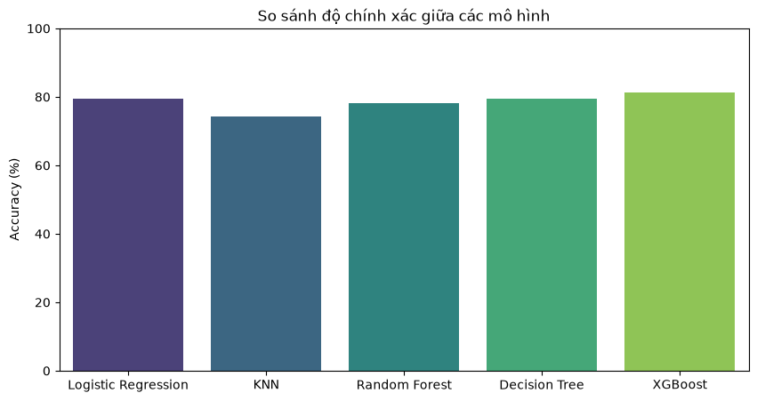

# ⚽ Dự Đoán Kết Quả FIFA World Cup với Machine Learning

<p align="left">
  
  
  
  
</p>

Dự án áp dụng các kỹ thuật học máy (Machine Learning) để phân tích tập dữ liệu lịch sử các kỳ World Cup từ năm 1930 đến 2026. Mục tiêu là xây dựng quy trình huấn luyện, đánh giá và so sánh hiệu suất giữa các mô hình học máy trên 2 bài toán chính:
1. **Hồi quy (Regression):** Dự đoán tổng số bàn thắng ghi được của Đội 1 (`total_goals_team1`).
2. **Phân loại đa lớp (Multi-class Classification):** Dự đoán kết quả trận đấu giữa hai đội bóng: **Thắng (2)**, **Hòa (1)**, hoặc **Thua (0)**.

---

## 📁 Cấu trúc thư mục dự án

```text
Fifaworldcup_ML/
│
├── Data/
│   └── fifa.csv                     # Tập dữ liệu lịch sử World Cup
│
├── Models/                          # Thư mục chứa các module thuật toán độc lập
│   ├── __init__.py                  # Đánh dấu package Python
│   ├── Linear_regression.py         # Dự đoán số bàn thắng
│   ├── Logistic_regression.py       # Hồi quy Logistic phân loại kết quả
│   ├── knn.py                       # K-Nearest Neighbors (kèm Scaler Pipeline)
│   ├── Decision_tree.py             # Cây quyết định (Decision Tree)
│   ├── Random_forest.py             # Rừng ngẫu nhiên (Random Forest)
│   └── Xgboost.py                   # Thuật toán phân loại XGBoost
│
├── saved_models/                    # Lưu trữ mô hình tối ưu nhất (.pkl)
│   └── best_model.pkl
│
├── fifa_worldcup.py                 # File thực thi chính (Main Pipeline)
├── model_comparison.png             # Biểu đồ so sánh độ chính xác giữa các model
├── README.md                        # Tài liệu hướng dẫn dự án
├── requirements.txt                 # Danh sách các thư viện phụ thuộc
└── .gitignore                       # Cấu hình bỏ qua file rác khi đẩy Git
```
## 📊 Kết quả so sánh (Results)
Dưới đây là biểu đồ so sánh độ chính xác (`Accuracy`) giữa các mô hình phân loại:



## ⚙️ Hướng dẫn cài đặt và sử dụng (How to Run)

1. **Clone repository này về máy của bro:**
   ```bash
   git clone [https://github.com/VoHoQuocAnh/Fifaworldcup_ML.git](https://github.com/VoHoQuocAnh/Fifaworldcup_ML.git)
   cd Fifaworldcup_ML  ```

2. **Cài đặt các thư viện:**
     pip install -r requirements.txt

3. ** Chạy chương trình:**
     python fifa_worldcup.py
   
